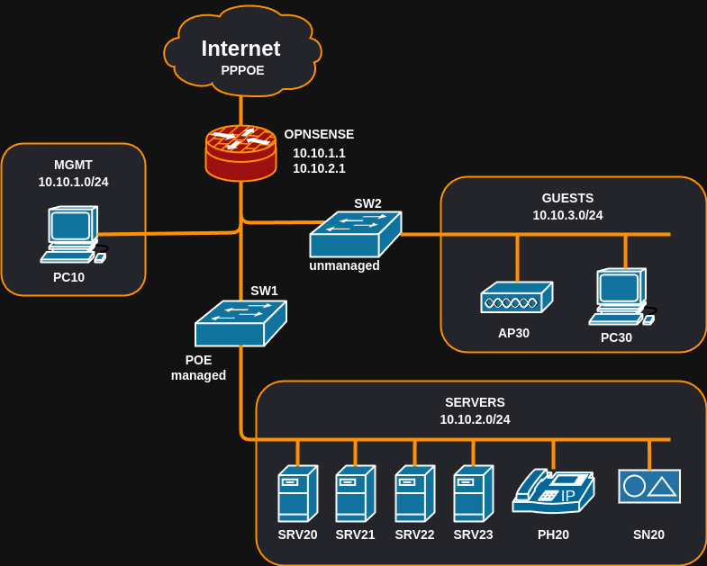

# OPNSense configuration

## Overview

4 x 2.5Gigabit ethernet ports

need vlans to isolate management, server, home.

I want management to be able to access the other vlans, but not the other vlans to access it.

all other trafic must be restricted between vlans

10.10. ... addresses



## Configuration Steps

### WAN

PPPOE

### VLANS

1. Create VLANs

   Go to ```Interfaces > Devices > VLAN```
      ```
      Add VLAN 10 on igc1 (Management)

      Add VLAN 20 on igc2 (Servers)

      Add VLAN 30 on igc3 (Guests)
      ```
      
2. Assign Interfaces

   Go to ```Interfaces > Assignments```
      ```
      Assign VLAN 10 to new interface (OPT1 renamed to MGMT)

      Assign VLAN 20 to new interface (OPT2 renamed to SERVERS)

      Assign VLAN 30 to new interface (OPT3 renamed to GUESTS)
      ```

3. Configure Interface Settings

   For each interface (MGMT, SERVERS, GUESTS):
      ```
      Enable the interface

      Set IPv4 Configuration Type to "Static IPv4"

      Set IP addresses:

         MGMT: 10.10.1.1/24

         SERVERS: 10.10.2.1/24

         GUESTS: 10.10.3.1/24
      ```

4. Configure DHCP Servers

   For each interface (MGMT, SERVERS, GUESTS):
       
      Go to ```Services > DHCPv4 > [interface]```
      ```
      Enable DHCP server

      Set range:

         MGMT: 10.10.1.100 - 10.10.1.200

         SERVERS: 10.10.2.100 - 10.10.2.200

         GUESTS: 10.10.3.100 - 10.10.3.200
      ```

### Firewall rules
1. Configure generic Firewall rules that allow all traffic

   For each interface (MGMT, SERVERS, GUESTS):
      
       
      Go to ```Firewall > Rules > [interface]```

      Set this rule :
      ```
      Protocol    Source      Port     Destination    Port     Gateway     Schedule    Description
      IPv4*       *           *        *              *        *           *           
      ```


### Server configuration

1. Proxmox hypervisor

   IP address 10.10.2.10

2. Fedora lifeline server 

   IP address 10.10.2.11

3. Fedora services server

   IP address 10.10.2.12

4. Homeassistant

   IP address 10.10.2.13

### Port forwarding (Option 1)

1. Port forwarding rules (DNAT)

      Go to ```Firewall > NAT > Port Forward```

      Set these rules :
      ```
         Interface 	Proto 	Address 	Ports 	Address 	      Ports 	   IP 	         Ports 	   Description
         WAN 	      TCP 	   * 	      * 	      WAN address    80 (HTTP) 	10.10.2.106 	80 (HTTP) 	Webserver HTTP Forward 
         WAN 	      TCP 	   * 	      * 	      WAN address    443 (HTTPS) 10.10.2.106 	443 (HTTP) 	Webserver HTTPS Forward 

      Filter rule association: Add associated filter rule (auto-creates a firewall rule).
      ```
2. Configure Firewall Rules (If Not Auto-Created)

      Go to ```Firewall > Rules > WAN```

      Make sure the rules were correctly created :
      ```
      Protocol    Source      Port     Destination    Port        Gateway     Schedule    Description
      IPv4 TCP 	* 	         * 	      10.10.2.106 	80 (HTTP) 	* 	         * 		      Webserver HTTP Forward
      IPv4 TCP 	* 	         * 	      10.10.2.106 	443 (HTTPS) * 	         * 		      Webserver HTTPS Forward        
      ```

3. Enable Hairpin NAT (For internal clients to access the server via the external domain)

      Go to ```Firewall > Settings > Advanced```

      Enable Reflection for port forwards

4. Disable the admin page on WAN interface

      Go to ```System > Settings > Administration``` 

      In ```Listen Interfaces``` select only the ```MGMT``` and ```SERVER``` VLANS

### Port forwarding (Option 2, not working yet)

1. Port forwarding rules (DNAT)

      Go to ```Firewall > NAT > Port Forward```

      Set these rules :
      ```
         Interface 	Proto 	Address 	Ports 	Address 	      Ports 	   IP 	         Ports 	   Description
         WAN 	      TCP 	   * 	      * 	      WAN address    80 (HTTP) 	10.10.2.106 	80 (HTTP) 	Webserver HTTP Forward 
         WAN 	      TCP 	   * 	      * 	      WAN address    443 (HTTPS) 10.10.2.106 	443 (HTTP) 	Webserver HTTPS Forward 

      Filter rule association: Add associated filter rule (auto-creates a firewall rule).
      ```
2. Configure Firewall Rules (If Not Auto-Created)

      Go to ```Firewall > Rules > WAN```

      Make sure the rules were correctly created :
      ```
      Protocol    Source      Port     Destination    Port        Gateway     Schedule    Description
      IPv4 TCP 	* 	         * 	      10.10.2.106 	80 (HTTP) 	* 	         * 		      Webserver HTTP Forward
      IPv4 TCP 	* 	         * 	      10.10.2.106 	443 (HTTPS) * 	         * 		      Webserver HTTPS Forward        
      ```

3. Enable Hairpin NAT (For internal clients to access the server via the external domain)

      Go to ```Firewall > NAT > Outbound```

      Set mode to "Hybrid" (to keep auto-generated rules).

      Add a manual rule:
      ```
      Interface 	Source      Source Port    Destination 	   Destination Port 	NAT Address 	NAT Port 	Static Port 	Description
      MGMT        MGMT net    tcp/ *         10.10.2.106/32 	tcp/ 80 	         MGMT address 	* 	         NO 	         Hairpin NAT for MGMT to Webserver 
      MGMT        MGMT net    tcp/ *         10.10.2.106/32 	tcp/ 443          MGMT address 	* 	         NO 	         Hairpin NAT for MGMT to Webserver 
      ```


MGMT computer (10.10.1.100) still cannot access the server on 10.10.2.106 


Note : not up to date (1 to 1 reflection, etc...)

### VPN 

Instances: in the wireguard configuration these are called “interfaces” and they describe how the virtual wgX device on our end is configured in terms of addressing and cryptography.

Peers: these are the clients that are allowed to connect to us, described by their optional remote address including the networks that are allowed to pass through the tunnel. Peers belong to one or more instances.

1. Wireguard instance config  

      Go to ```VPN > WireGuard > Instances```

      Click "+" to add a new instance

|Name|Input field|
|:---|:---|
|Enabled|```checked```|
|Name|vpn0|
|Public key| leave blank (or add pubkey)|
|Private key| leave blank (or add pkey)|
|Listen port| 51822 (2 because server vlan)|
|Tunnel address| 10.11.2.1/24 (cannot be on any network you are connecting to or from)|
|Peers| leave blank initially |
| Disable routes|```unchecked```|

2. Client peer config (generator)

      Go to ```VPN > WireGuard > Peer generator```


|Name|Input field|
|:---|:---|
|Instance|vpn0|
|Endpoint|91.179.88.45:51822|
|Name|vpn0usr0|
|Public key|automatically filled|
|Private key|automatically filled|
||automatically filled|
|Pre-shared| Leave blank, or generate one for extra security|
|Allowed IPs|0.0.0.0/0,::/0|
|DNS Servers|10.11.2.1 (wireguard tunnel address)|

Click apply !!!!

3. Enable interface

      Go to ```Interfaces > Assignments```

      Assign a new interface : ```wg0 (WireGuard - vpn0)``` and click Add
      
      Go to ```Interfaces > [vpn0]```

      Tick both ```Enable Interface``` and ```Prevent interface removal```

      Save

4. Firewall rules (WAN interface)

   Go to ```Firewall > Rules > vpn0```

   Add a rule that allows anything 
   

5. Firewall rules (vpn0 interface)

   Go to ```Firewall > Rules > WAN```

   


### Note


1To -> all applications (2vms one for proxymanager & ddns updater & vaultwarden (k8s for all 3, 2 pods each), one for the services)
300Go*2 -> double backups vms data

NginxProxyManager -> traefik

on management pc : ansible


suricata


can I have three vms that do exactly the same thing, using k8s, with a control plane on each one, and only one control plane is active, and it controls pods of every machine. if the active control plane dies (vm stops) one inactive control plane starts and manages the pods left.

